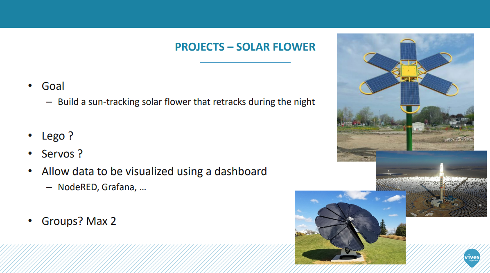
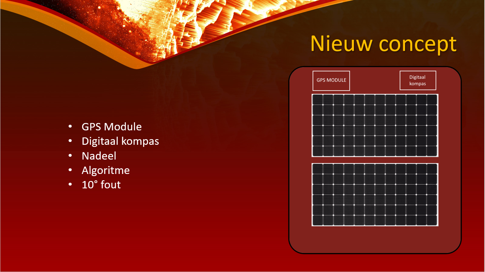
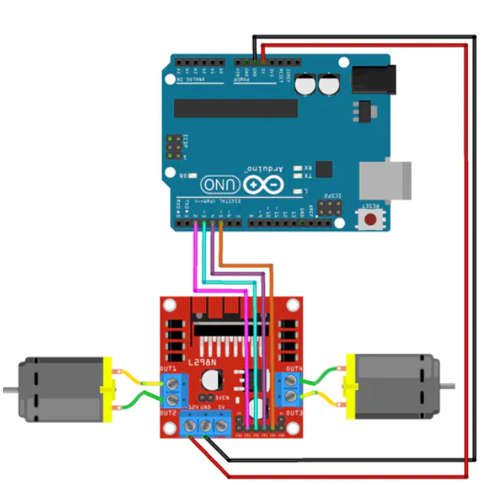

# Solar Flower

## Members

* Dieter Dewachter
* Timon Claerhout
* Robin Jonckheere
* Maxim Govaert

## Assignment

## The plan

We werken met een digitaal kompas ([BNO055](./img/kompas.PNG)) om het noorden te vinden. Hieruit kunnen we de zonnepanelen direct naar het oosten positioneren, want daar komt de zon op. Hierdoor kan je ze plaatsen in welke richting je wilt.

Via een [algoritme](algoritme_positie_zon.ino) bepalen we in welke hoek de zonnepanelen moeten staan.
Dit heeft een afwijking van 10 graden wat niet voor een groot verlies zorgt.
Om te achterhalen in welke hoek de zonnepanelen staan maken we gebruik van een accelerometer ([Grove - 3-Axis Digital Accelerometer](./img/Accelerometer.PNG))

Om de zonnepanelen te draaien zowel horizontaal als verticaal gebruiken we een Lego opstelling met 2 motoren die we kunnen aansturen via een Arduino met een H-brug ([L298N](./img/H-brug.PNG)).

## Sensors

Bij onze zonnepanelen sluiten we allerlei sensoren aan, deze data visualeren we op Adafruit.
Om de data door te sturen, maken we gebruik van een ESP ([ESP8266](./img/ESP.PNG)) die een wifi module bevat die dit doorstuurt naar Adafruit.
Hierdoor kunnen we op afstand via een GSM, computer, ... volgen in welke toestand de zonnepanelen zich bevinden.

Met de GPS module ([Groove GPS module](./img/GPS)) bepalen we de longitude en latitude om de locatie te bepalen. Die we vervolgens in google maps kunnen weergeven op Adafruit

Met de stroomspanningsmeter ([INA260](./img/Meter.PNG)) zien we wat voor stroom en spanning de zonnepanelen leveren. Hieruit halen we ook het vermogen (P = U*I).

## Project

Dit is ons eindproject.

